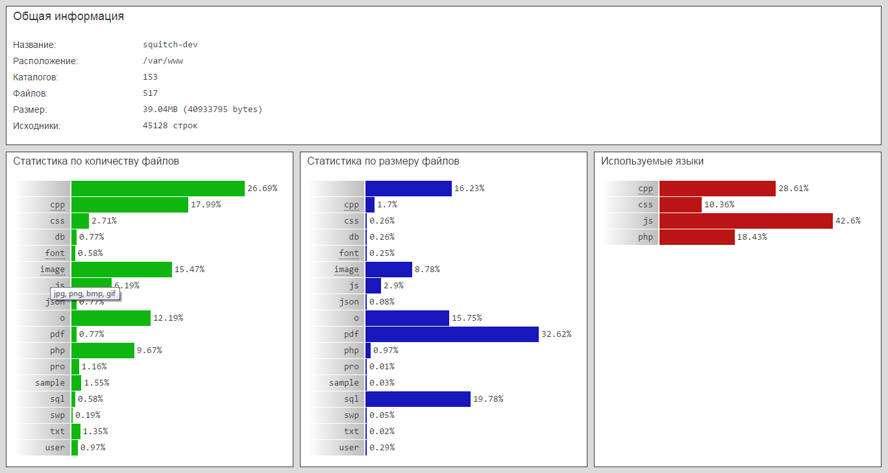

## Project Statistics

Сбор и отображение статистики по проекту одним файлом. Необходимо файл pro.php положить в корневой каталог проекта и открыть его через браузер (необходим интерпретатор php5+). Файл осуществляет рекурсивный обход рабочего каталога и собирает статистику, базируясь на расширении файлов. Отображает общую полученную информацию, а также статистику по количеству и размеру файлов различных типов и используемых языках программирования.

**Особенности**

+ Возможность игнорирования файлов определенных типов (.git, .gitignore, .temp и прочее).
+ Объединение однотипных файлов в один набор (изображения, шрифты и прочее).
+ Подсчет количества строк кода в указанных файлах исходников.
+ Файл сбора статистики будучи в рабочем каталоге также будет учитываться.

**Реализация**

Интерфейс базового класса статистики _ProjectStat_:
+ `__construct($dir)`: Конструктор класса с указанием рабочего каталога.
+ `Destroy()`: Деструктор класса не используется.
+ `getError()`: Получить текст последней ошибки.
+ `getStat()`: Получить сырую статистику как ассоциативный массив.
+ `getOptions()`: Получить настройки как ассоциативный массив.
+ `addType($name, $extensions)`: Добавить свой тип файлов как объединение указанных.
+ `removeType($name)`: Удалить созданный ранее свой тип файлов.
+ `addSource($extensions)`: Добавить типы файлов на отслеживание как исходники.
+ `removeSource($extensions)`: Удалить типы файлов из отслеживаемых как исходники.
+ `addIgnore($extensions)`: Добавить типы файлов на игнорирование.
+ `removeIgnore($extensions)`: Удалить типвы файлов из игнорирования.
+ `static prepStat($stat)`: Статический метод формирования полной статистики.

Настройки класса по умолчанию:
```php
/** @type [array] настройки */
private $options = array(
  /** @type [array] список расширений игнорируемых файлов */
  'ignore' => array('gitignore', 'git'),
  /** @type [array] список расширений исходников */
  'source' => array(),
  /** @type [array] возможные типы файлов */
  'types' => array(
    'image' => array('jpg', 'png', 'bmp', 'gif'),
    'font' => array('eot', 'ttf', 'woff')
  )
);
```

Пример наследования класса статистики для *AMP-приложения:
```php
class ProjectStat_AMP extends ProjectStat {
  /**
   * Конструктор
   * @param [string] $dir корневая директория проекта
   */
  public function __construct($dir) {
    // создание экземпляра
    parent::__construct($dir);
    // расширения файлов игнорирования
    $this->addIgnore(array('htaccess'));
    // расширения файлов исходников
    $this->addSource(array('js', 'php', 'css', 'cpp', 'h'));
    // определение типов файлов
    $this->addType('cpp', array('cpp', 'h'));
  }
}
```

Пример использования класса:
```php
// инициализация объекта статистики
$pro = new ProjectStat_AMP('./');
if ($error = $pro->getError()) {
    die($error);
}
// получить текущие настройки
$options = $pro->getOptions();
// получить статистику в текущем каталоге
$stat = ProjectStat_AMP::prepStat($pro->getStat());
```

Пример отображаемой статистики:


